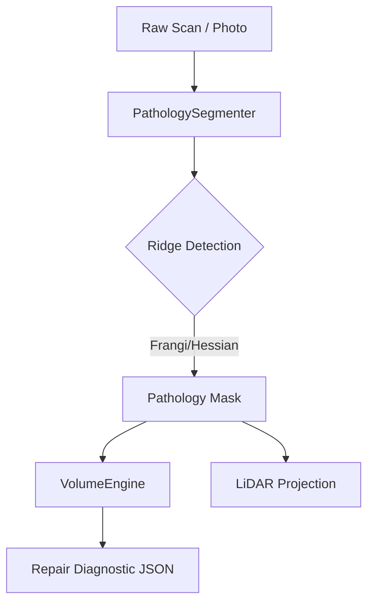

# 👁️ AuraVision

> [!IMPORTANT]
> **Project Status: Concept / Scaffold (2028+)**
> This repository is part of Maycon Alves' technical vision for the AEC Tech ecosystem. It is currently in the **concept and initial architecture phase**. Full development and core implementation will resume after the author returns from his mission in **2028**.


**Forensic Computer Vision & LiDAR Engine for Structural Inspection**

AuraVision is a professional-grade forensic engine designed to automate the detection, segmentation, and volumetric analysis of structural pathologies. By integrating advanced ridge-detection algorithms with LiDAR georeferencing logic, it transforms raw site data into actionable repair diagnostics.

---

## 🚀 Key Features

- **Automated Pathology Segmentation**: Uses Frangi and Hessian ridge-detection filters to isolate cracks, efflorescence, and structural discontinuities.
- **Volumetric Repair Estimation**: Calculates required material volumes (Liters/m³) based on segmented surface area and standard repair depths.
- **LiDAR Integration**: georeferences visual pathologies onto 3D point clouds for precise spatial tracking.
- **FastAPI Core**: Headless REST API designed for integration with CDEs (Common Data Environments) and BIM platforms.

## 🏗️ Architecture



## 🛠️ Getting Started

1. **Install Dependencies**:
   ```bash
   pip install -r requirements.txt
   ```

2. **Run Diagnostic Test**:
   ```bash
   python lab/smoke_test.py
   ```

3. **Start API Service**:
   ```bash
   uvicorn api.main:app --reload
   ```

## ⚖️ Legal & Standards
Designed to support forensic engineering workflows compliant with **ISO 13822** (Assessment of existing structures) and **ASTM E2018** (Property Condition Assessments).

---
*Developed by Maycon Alves for the NexusTwin Ecosystem.*

